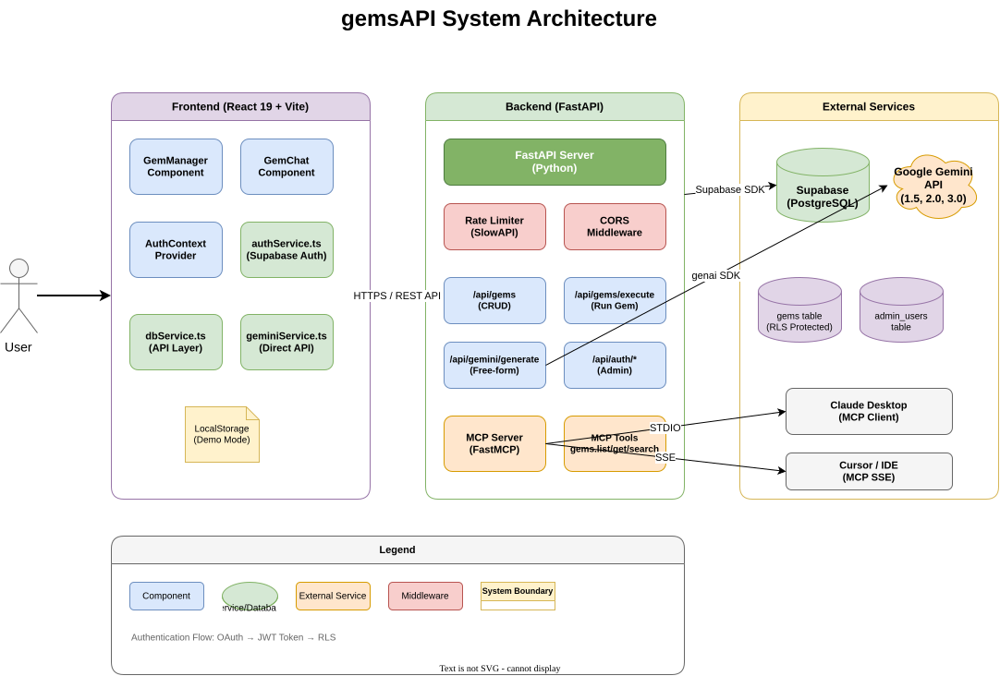
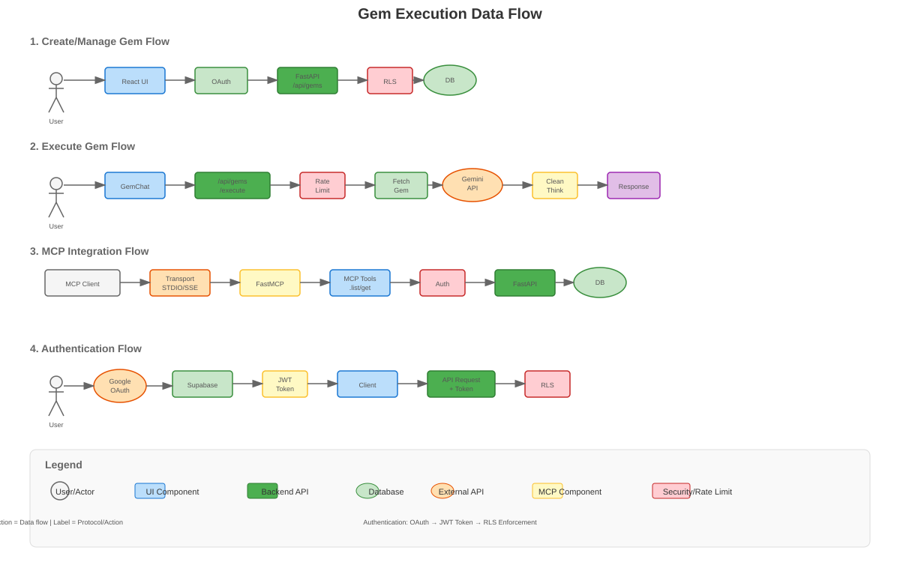
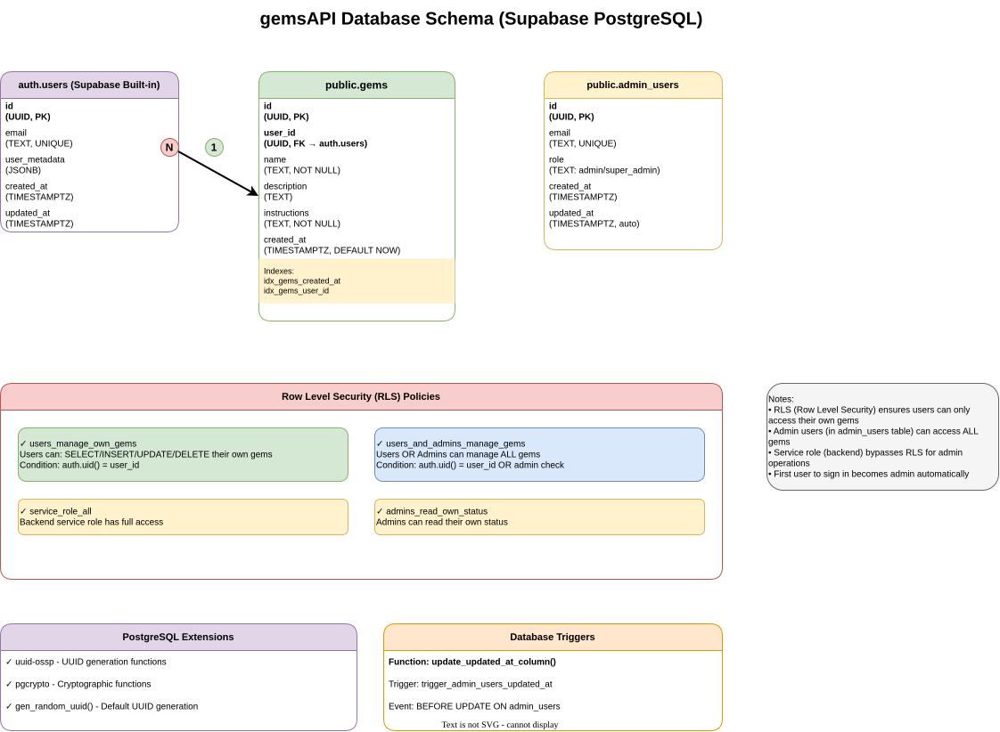

# gemsAPI

[](https://www.typescriptlang.org/)
[](https://fastapi.tiangolo.com/)
[](https://react.dev/)
[](LICENSE)

> A flexible API interface for managing and executing custom AI instructions ("Gems") using Google Gemini models with MCP integration.

Since the standard Gemini Gems interface does not currently support direct API access, gemsAPI emulates that functionality by providing a complete backend service for storing, managing, and executing custom AI prompts with the latest Gemini 3.0 models.

## ✨ Features

- **Gem Management**: Create, edit, and delete custom AI instruction sets ("Gems") stored in Supabase
- **Flexible Execution**: Execute Gems by name with custom user prompts via REST API
- **Gemini 3.0 Support**: Full support for Gemini 1.5, 2.0, and 3.0 series with low-latency thinking
- **MCP Integration**: Model Context Protocol (MCP) server for Claude Desktop and other MCP clients
- **Authentication**: Supabase-based authentication with Row Level Security (RLS)
- **Rate Limiting**: Built-in rate limiting to prevent abuse
- **React UI**: Modern web interface for gem management and testing
- **Docker Ready**: Containerized deployment with multi-stage builds

## 🏗️ Architecture

### System Architecture



gemsAPI is a full-stack application with a React frontend, FastAPI backend, Supabase database, and Google Gemini AI integration. The system supports multiple transport mechanisms including REST API, MCP SSE transport, and MCP STDIO for Claude Desktop.

**Key Components:**
- **Frontend**: React 19 + Vite, served statically by FastAPI
- **Backend**: FastAPI with async/await, rate limiting, and CORS
- **Database**: Supabase (PostgreSQL) with Row Level Security
- **AI Integration**: Google Gemini API with thinking artifact cleanup
- **MCP Server**: FastMCP integration for tool-based access

### Data Flows



**Key Workflows:**
1. **Create/Manage Gem**: User → React UI → OAuth → FastAPI → RLS Check → Supabase
2. **Execute Gem**: User → GemChat → Rate Limit → Fetch Gem → Gemini API → Clean Thinking → Response
3. **MCP Integration**: MCP Client → Transport (STDIO/SSE) → FastMCP → API Auth → Database
4. **Authentication**: Google OAuth → JWT Token → Client → Bearer Token → RLS Enforcement

### Database Schema



**Tables:**
- `auth.users` - Supabase built-in user authentication
- `public.gems` - Gem definitions with user ownership and RLS
- `public.admin_users` - Administrator accounts for full access

**Row Level Security (RLS):**
- Users can only manage their own gems
- Admin users can manage ALL gems
- Service role bypasses RLS for backend operations

## 🚀 Quick Start

### Prerequisites

- Docker & Docker Compose (recommended)
- Supabase account and project
- Google Gemini API key

### Installation

#### 1. Clone the repository

```bash
git clone https://github.com/sruckh/gemsAPI.git
cd gemsAPI
```

#### 2. Configure environment variables

Create a `.env` file in the project root:

```bash
cp .env.example .env
```

Edit `.env` with your credentials:

```env
# Required
GEMINI_API_KEY=your_gemini_api_key
SUPABASE_URL=your_supabase_project_url
SUPABASE_KEY=your_supabase_service_role_key

# Optional (with defaults)
GEMINI_MODEL=gemini-3-pro-preview
PORT=8000
NODE_ENV=production

# MCP Integration
ENABLE_MCP=true
API_TOKEN=your_secure_api_token_for_mcp
```

#### 3. Start with Docker Compose

```bash
docker compose up -d --build
```

The service will be available at `http://localhost:8000`

### Local Development (Manual)

If you prefer to run without Docker:

#### 1. Install dependencies

**Frontend:**
```bash
npm install
```

**Backend:**
```bash
pip install -r requirements.txt
```

#### 2. Run frontend (development mode)

```bash
npm run dev
```

#### 3. Run backend

```bash
uvicorn fastapi_server:app --reload --host 0.0.0.0 --port 8000
```

## 📖 Documentation

### API Reference

#### Gems Management

| Method | Endpoint | Description |
|--------|----------|-------------|
| `GET` | `/api/gems` | List all gems (requires auth) |
| `POST` | `/api/gems` | Create a new gem |
| `PUT` | `/api/gems/{id}` | Update a gem |
| `DELETE` | `/api/gems/{id}` | Delete a gem |
| `GET` | `/api/gems/{id}/package` | Get gem as prompt package |

#### Execution

| Method | Endpoint | Description |
|--------|----------|-------------|
| `POST` | `/api/gems/execute` | Execute a gem by name |
| `POST` | `/api/gemini/generate` | Free-form generation with custom instructions |

#### MCP Integration

| Method | Endpoint | Description |
|--------|----------|-------------|
| `GET` | `/.well-known/mcp.json` | MCP manifest |
| `GET` | `/mcp` | MCP SSE transport endpoint |
| `GET` | `/api/mcp/ping` | MCP auth check |
| `GET` | `/api/mcp/stdio-script` | Download STDIO script for Claude Desktop |
| `GET` | `/api/mcp/claude-desktop-config` | Claude Desktop configuration |

#### Authentication

| Method | Endpoint | Description |
|--------|----------|-------------|
| `POST` | `/api/auth/check-admin` | Check if user is admin |
| `POST` | `/api/auth/register-admin` | Register first admin (one-time) |

### Configuration

| Variable | Description | Default |
|----------|-------------|---------|
| `GEMINI_API_KEY` | Google Gemini API key | *required* |
| `SUPABASE_URL` | Supabase project URL | *required* |
| `SUPABASE_KEY` | Supabase service role key | *required* |
| `GEMINI_MODEL` | Default Gemini model | `gemini-3-pro-preview` |
| `PORT` | Server port | `8000` |
| `NODE_ENV` | Environment mode | `production` |
| `ENABLE_MCP` | Enable MCP integration | `false` |
| `API_TOKEN` | Bearer token for API/MCP bypass | *none* |

### Database Schema

For the complete database schema with all tables, relationships, and RLS policies, see the [ER Diagram](./docs/diagrams/er-diagram.svg) above.

**Quick Reference:**
- Full SQL schema available in [`docs/supabase/gems_table.sql`](./docs/supabase/gems_table.sql)
- RLS ensures users can only access their own gems (except admins)
- Admin users table for elevated permissions

### MCP Integration

gemsAPI provides Model Context Protocol (MCP) integration for tool-based access to gems.

#### Claude Desktop Setup

1. Download the STDIO script:
```bash
curl -H "Authorization: Bearer YOUR_TOKEN" \
  https://your-domain.com/api/mcp/stdio-script \
  -o gemsapi_mcp.py
```

2. Edit your Claude Desktop config:
   - **macOS**: `~/Library/Application Support/Claude/claude_desktop_config.json`
   - **Windows**: `%APPDATA%\Claude\claude_desktop_config.json`

```json
{
  "mcpServers": {
    "gemsapi": {
      "command": "python",
      "args": ["/path/to/gemsapi_mcp.py"],
      "env": {
        "GEMSAPI_TOKEN": "YOUR_SUPABASE_ACCESS_TOKEN",
        "GEMSAPI_URL": "https://your-domain.com"
      }
    }
  }
}
```

3. Install dependencies:
```bash
pip install fastmcp httpx
```

4. Restart Claude Desktop

#### Available MCP Tools

- `gems.list`: List all gems for authenticated user
- `gems.get`: Get a specific gem by ID or name
- `gems.search`: Search gems by name or description

### Security Considerations

**Secret hygiene:**
- Never add `SUPABASE_KEY` (service role) to `VITE_*` variables
- The backend fails to start if service key is exposed to frontend
- Use `API_TOKEN` for server-to-server communication only
- Run `npm run secret:check` before committing to scan for leaked tokens

**Authentication:**
- All data operations require valid Supabase JWT token
- Row Level Security (RLS) ensures users can only access their own gems
- Admin operations require entry in `admin_users` table

## 🧪 Testing

### Manual Testing

```bash
# Health check
curl http://localhost:8000/healthz

# List gems (requires auth token)
curl -H "Authorization: Bearer YOUR_TOKEN" \
  http://localhost:8000/api/gems

# Execute a gem
curl -X POST http://localhost:8000/api/gems/execute \
  -H "Content-Type: application/json" \
  -H "Authorization: Bearer YOUR_TOKEN" \
  -d '{"gem_name": "MyGem", "user_prompt": "Hello!"}'
```

### Security Scan

```bash
# Scan for leaked secrets before committing
npm run secret:check
```

## 📦 Build & Deployment

### Docker Build

```bash
# Build image
docker build -t gemsapi:latest .

# Run container
docker run -p 8000:8000 --env-file .env gemsapi:latest
```

### Production Deployment

1. Set `NODE_ENV=production` in `.env`
2. Ensure `VITE_SUPABASE_KEY` is NOT set (security check)
3. Build frontend: `npm run build`
4. Use reverse proxy (Nginx, Traefik) for SSL
5. Configure proper CORS origins via `FRONTEND_URL`

### Nginx Proxy Manager Example

```nginx
# Forward proxy configuration
location /gemsapi/ {
    proxy_pass http://gemsapi:8000/;
    proxy_set_header Host $host;
    proxy_set_header X-Real-IP $remote_addr;
    proxy_set_header X-Forwarded-For $proxy_add_x_forwarded_for;
    proxy_set_header X-Forwarded-Proto $scheme;
}
```

## 🤝 Contributing

Contributions are welcome! Please follow these guidelines:

1. Fork the repository
2. Create a feature branch (`git checkout -b feature/amazing-feature`)
3. Make your changes
4. Run tests and security checks
5. Commit changes (`git commit -m 'Add amazing feature'`)
6. Push to branch (`git push origin feature/amazing-feature`)
7. Open a Pull Request

### Development Guidelines

- Follow existing code style and patterns
- Add TypeScript types for all new code
- Update documentation for API changes
- Test MCP integration when modifying tools
- Run `npm run secret:check` before committing

## 📄 License

This project is licensed under the MIT License - see [LICENSE](LICENSE) for details.

## 🙏 Acknowledgments

- **Google** - For the Gemini AI models and API
- **Supabase** - For the excellent PostgreSQL backend service
- **FastAPI** - For the modern Python web framework
- **React** - For the frontend UI framework
- **FastMCP** - For MCP integration toolkit

## 📚 Additional Documentation

- [Phase 2 MCP Integration](./phase-2-MCP.md) - MCP implementation details
- [CLAUDE.md](./CLAUDE.md) - Project-specific guidance for Claude Code
- [AGENTS.md](./AGENTS.md) - Agent configuration and usage

## 🔗 Links

- [Gemini API Documentation](https://ai.google.dev/)
- [Supabase Documentation](https://supabase.com/docs)
- [FastAPI Documentation](https://fastapi.tiangolo.com/)
- [MCP Specification](https://modelcontextprotocol.io/)
